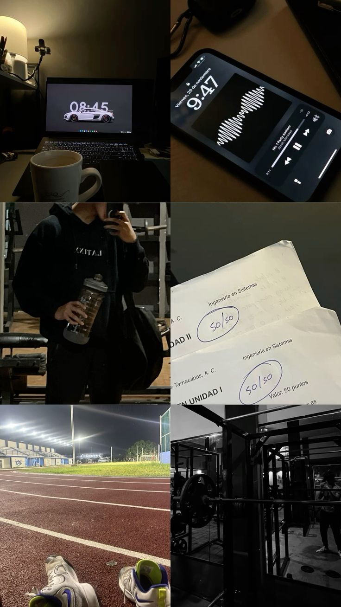
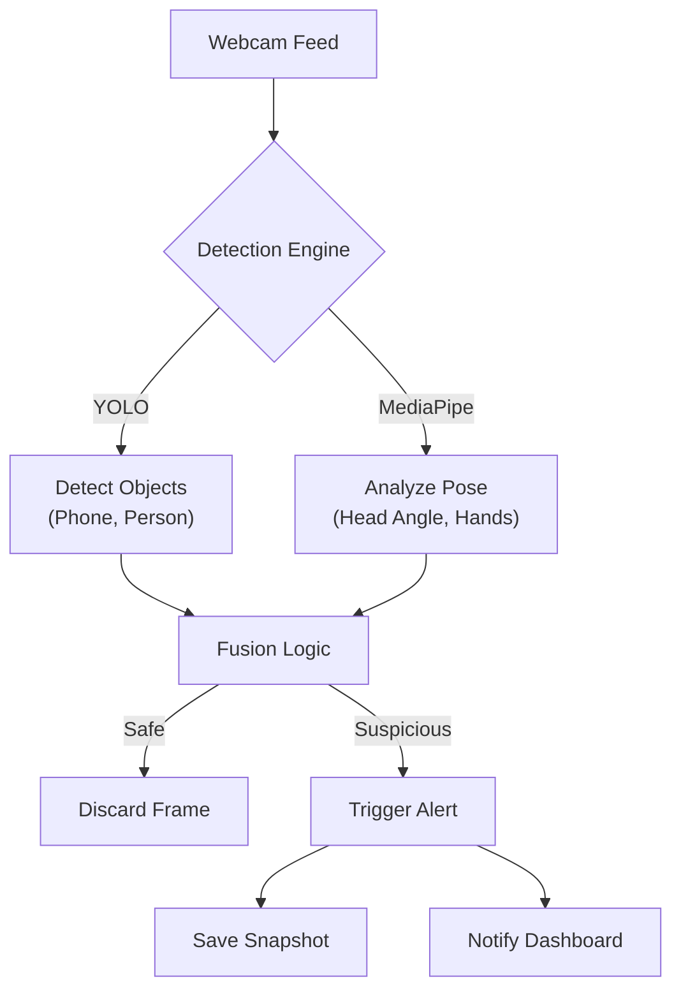

# 🕵️‍♂️ Exam Cheat Detection System


> **A privacy-first, real-time computer vision system tailored for remote exam proctoring.**

This project uses **YOLOv11** and **MediaPipe** to detect suspicious behaviors (phones, multiple people, looking away) without recording audio or processing biometric templates.

---

## 📸 Demo Preview

<!-- PLACEHOLDER: Replace this image with a GIF of your system in action! -->


*(Snapshot from initial testing)*

---

##  Objectives
*   **👁️ Visual-Only Monitoring**: No audio scraping or invasive biometrics.
*   **⚡ Real-Time Alerts**: Instant feedback on suspicious activities.
*   **🛡️ Privacy First**: Only flagged frames are stored; everything else is discarded.
*   **📊 Instructor Dashboard**: Review timeline of events with evidence snapshots.

---

##  Tech Stack

| Component | Technology | Use Case |
| :--- | :--- | :--- |
| **Detection** | YOLOv11 | Object detection (Phones, People) |
| **Pose/Face** | MediaPipe | Head orientation, hand tracking |
| **Backend** | Python & OpenCV | Core processing pipeline |
| **Frontend** | Flask | Proctor Dashboard & Analytics |
| **Log** | JSON/SQLite | Metadata storage |

---

##  How It Works



---

##  Setup & Installation

### Prerequisites
*   Python 3.8+
*   Git
*   Webcam

### Quick Start
```powershell
# 1. Clone the repository
git clone https://github.com/Aladdin-Ghribi/exam-cheat-detection.git
cd exam-cheat-detection

# 2. Create Virtual Environment
python -m venv venv
venv\Scripts\Activate.ps1

# 3. Install Dependencies
pip install -r requirements.txt
```

###  Running the System

**1. Smoke Test (Verify Detection)**
```powershell
python src/detection/yolo_smoke_test.py
```

**2. Launch Dashboard**
```powershell
streamlit run dashboard.py
```

---

##  Project Status (Week 11)

| Team Member | Role | Key Contributions |
| :--- | :--- | :--- |
| **Aladdin Ghribi** | Dev A | Repo init, YOLO pipelines, Core logic |
| **Malak Khalaf** | Dev B | Project tracking, Dashboard, Documentation |

✅ **Current Milestone**: Week 1 - 11 Complete
🔜 **Next Up (Week 13)**: Full alert integration & final polish.

---

## 🔗 Project Board
[View Progress on GitHub Projects](https://github.com/users/Aladdin-Ghribi/projects/1)
