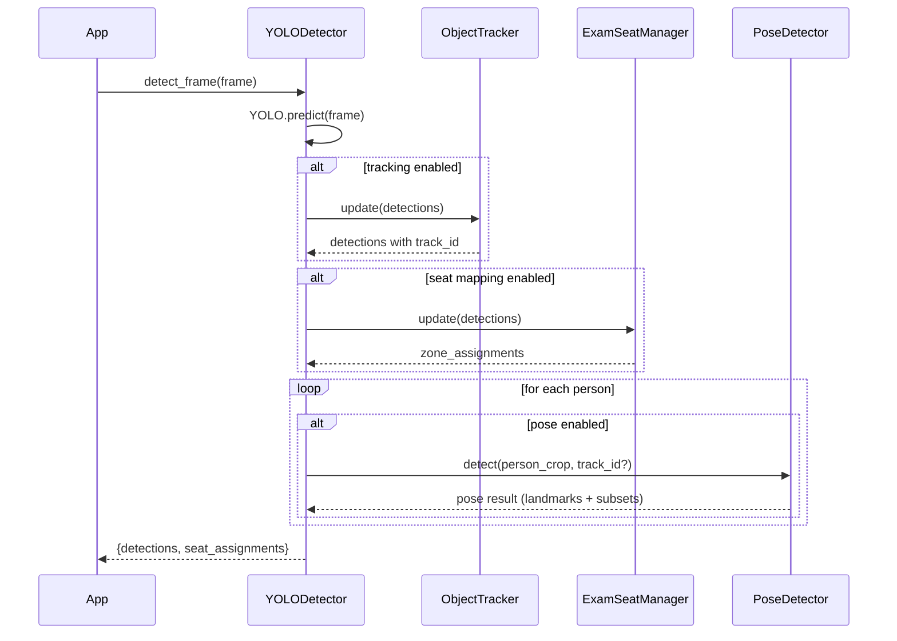

## Real‑Time Cheating Detection System — Detection Pipeline Guide

Course/Project: ******\*\*******\_\_\_******\*\*******
Authors: ******\*\*******\_\_\_******\*\*******
Date: ******\*\*******\_\_\_******\*\*******

Audience: Instructors, reviewers, and developers (detection pipeline)

Export tip: View this file in VS Code and export to PDF (see docs/Export-to-PDF.md).

---

### Executive summary (1 minute)

- The system detects cheating cues in real time using a hybrid pipeline: YOLO for objects/persons, lightweight tracking for stable IDs, zone-based seat mapping, and MediaPipe pose for keypoints. These signals are combined and visualized for instructors.
- The design is explainable and privacy-conscious: only flagged events need to be retained; keypoints can be stored instead of full frames.
- Week 5 adds head pose, hand proximity, and temporal scoring to further reduce false positives and jitter before training any supervised model.

---

### 1) System overview

This guide covers the computer-vision pipeline (detection side). The web app/UI portion is documented separately by your teammate.

- Input: webcam/video frames
- Outputs:
  - Annotated frames (boxes, IDs, pose skeleton)
  - Detections list (objects + persons)
  - Optional seat assignments per person
  - Metrics (counts by class)

High-level data flow (detection pipeline only):

```mermaid
flowchart LR
    A[Frame] --> B[YOLO: objects + persons]
    B --> C{Tracking enabled?}
    C -- yes --> D[ObjectTracker: assign track_id]
    C -- no --> E[No tracking]
    D --> F{Seat mapping enabled?}
    E --> F
    F -- yes --> G[ExamSeatManager: zones + stability]
    F -- no --> H[Skip seat map]
    D --> I{Pose enabled?}
    E --> I
    I -- for each person --> J[PoseDetector (MediaPipe): keypoints + smoothing]
    J --> K[Aggregate results]
    G --> K
    H --> K
    B --> K
    K --> L[Annotated frame + JSON results]
```

---

### 2) Key modules and responsibilities

- `src/detection/yolo_detector.py`: Orchestrates YOLO inference, optional tracking, seat mapping, pose, and drawing.
- `src/detection/object_tracker.py`: Lightweight centroid-based multi-object tracking for people.
- `src/detection/exam_seat_manager.py`: Seat zone assignment and stability tracking per person.
- `src/detection/pose_detector.py`: MediaPipe Pose wrapper with temporal smoothing and helpers.

Component relationships:

```mermaid
classDiagram
    class YOLODetector {
      - model: YOLO
      - tracker: ObjectTracker?
      - seat_manager: ExamSeatManager?
      - pose_detector: PoseDetector?
      + detect_frame(frame) Result
      + draw_detections(frame, result) Image
    }
    class ObjectTracker {
      + update(detections) detections_with_ids
    }
    class ExamSeatManager {
      + update(detections) {zone_assignments, zones}
      + draw_zones(frame, assignments) frame
    }
    class PoseDetector {
      + detect(person_img, track_id?) PoseResult
      + draw_landmarks(image, lm, connections) image
    }
    YOLODetector --> ObjectTracker
    YOLODetector --> ExamSeatManager
    YOLODetector --> PoseDetector
```

---

### 3) YOLO detector (conductor)

Location: `src/detection/yolo_detector.py`

Responsibilities:

- Load YOLO model specified in `config.py` (`YOLO_MODEL`, `CONFIDENCE_THRESHOLD`, `IMG_SIZE`).
- Filter to person + cheating-related classes (phone, book, laptop, backpack, handbag).
- For each frame:
  - Run YOLO; package detections as dicts.
  - If enabled: pass detections through tracker → stable `track_id` per person.
  - If enabled: seat assignment for tracked persons (zones + stability).
  - If enabled: crop each person and run pose → keypoints with smoothing.
  - Return a structured result for UI and logging.

Sequence for a single frame:



Drawing overlay:

- Boxes and labels for all detections.
- Track IDs and stable position indicator for persons.
- Optional pose skeleton overlay inside each person box.
- Optional seat map overlay.

---

### 4) Pose detector (MediaPipe + smoothing)

Location: `src/detection/pose_detector.py`

Highlights:

- Uses MediaPipe Pose with `model_complexity=0` for speed.
- Temporal smoothing via per-track landmark history (`deque`, `history_length=5`, `smoothing_factor=0.7`).
- Returns structured subsets: `head`, `shoulders`, `hands` to support downstream logic (head pose, hand proximity).
- Helper to draw landmarks and simple posture metrics.

Why smoothing matters:

- Reduces jitter when multiple people are in frame.
- Stabilizes head/hand positions for proximity checks and future scoring.

---

### 5) Object tracker (IDs across frames)

Location: `src/detection/object_tracker.py`

Highlights:

- Centroid-based assignment (Euclidean distance) for person detections.
- Maintains `tracks` history and `disappeared` counters, registers/deregisters automatically.
- Attaches `track_id` and `centroid` back to each person detection.

Why IDs matter:

- Enables temporal logic per person (smoothing, seat mapping, cheat scoring).
- Supports dashboard views keyed by person/seat over time.

---

### 6) Exam seat manager (zones + stability)

Location: `src/detection/exam_seat_manager.py`

Highlights:

- Dynamic zone creation near a person’s stable position.
- Re-assigns persons to the same zone if inside/near it (tunable thresholds).
- Computes a stability score from recent position variance.
- Optional drawing (kept minimal to reduce overlay clutter).

Benefits:

- Gives an instructor-facing seat map association (person ↔ seat zone).
- Stability helps filter transient movement vs. meaningful seat shifts.

---

### 7) Data structures (returned per frame)

Result from `YOLODetector.detect_frame(frame)`:

- `detections`: list of dicts; each detection may include:

  - `class_id`: int (0 = person, others = cheating-related objects)
  - `confidence`: float
  - `bbox`: [x1, y1, x2, y2]
  - `track_id`: int (for persons, if tracking enabled)
  - `centroid`: (x, y) for persons
  - `stable_position`: (x, y) if available (from seat manager)
  - `pose`: Pose result dict for persons if pose enabled, including:
    - `success`: bool
    - `landmarks`: list of {x, y, z, visibility}
    - `head`, `shoulders`, `hands`: subsets

- `seat_assignments`: dict mapping `track_id` → `zone_id` (if seat mapping enabled)

---

### Teacher quick demo steps (2–3 minutes)

1. Start the app
   - Windows PowerShell:
     - `cd C:\Users\\Mega_pc\\Desktop\\Exam-cheat-detection`
     - `.\\venv\\Scripts\\Activate.ps1`
     - `pip install -r requirements.txt`
     - `python src\\cheat_detection_web_app\\app.py`
   - Open `http://localhost:5000`.
2. Show the overlays
   - Place two people in frame; move heads and hands; hold a phone/book.
   - Point out: boxes, class labels, track IDs, pose skeleton, and (optionally) seat mapping.
3. Explain robustness
   - Tracking gives stable IDs, pose smoothing reduces jitter, seat zones stabilize location.
4. Discuss Week 5
   - Head pose angles, hand proximity, and a per-person cheat_score with temporal smoothing.

---

### 8) Configuration and runtime controls

Central config: `config.py`

- `YOLO_MODEL`: path to model weights (`yolo11s.pt`, `yolo11n.pt`, `yolo11m.pt`)
- `CONFIDENCE_THRESHOLD`, `IMG_SIZE`

Runtime toggles (constructor flags):

- `enable_tracking`, `enable_seat_mapping`, `enable_pose`

Frontend (web app) can toggle pose per-frame; detector respects that flag.

---

### 9) Week 5 roadmap (detection-side)

Add signals to improve robustness before supervised training:

- Head pose (yaw/pitch/roll) via solvePnP using face/head keypoints → attach `head_pose` to person detections.
- Hand proximity checks to face/desk; overlap checks with detected objects (e.g., phone in hand region).
- Temporal smoothing/hysteresis: require N consecutive frames to raise an alert; cooldown after event.
- `cheat_score` with reasons; save-on-flag (thumbnail + keypoints JSON + metadata).

Integration points:

- Compute features in `YOLODetector.detect_frame()` using `pose` subsets and YOLO classes.
- Expose `cheat_score` and `reasons` in results; draw onto frame via `draw_detections()`.

---

### 10) Future: supervised model (hybrid)

Once a few hundred labeled clips are collected:

- Start with a keypoint-sequence classifier (1D-CNN or Bi-LSTM) over normalized 2D keypoints.
- Use rules to propose candidate events; classifier filters false positives.
- Train locally on RTX 3070 (mixed precision, small batches). Use Colab only for heavy runs.

---

### 11) How to run (quick)

Windows PowerShell:

```powershell
cd "C:\\Users\\Mega_pc\\Desktop\\Exam-cheat-detection"
.\venv\Scripts\Activate.ps1
pip install -r requirements.txt
python src\cheat_detection_web_app\app.py
```

Open `http://localhost:5000`.

---

### 12) Glossary

- YOLO: Object detector (Ultralytics) providing class IDs, confidences, and bounding boxes.
- Track ID: Stable integer identity per person across frames.
- Zone/Seat: Rectangular area associated with a person’s stable position.
- Landmarks: Pose keypoints (x, y, z, visibility) from MediaPipe.
- Temporal smoothing: Reduces jitter by averaging over recent frames.
- Hysteresis: Require persistence across frames to reduce flicker in alerts.

---

### 13) FAQ (brief)

- Q: Why not track all objects, not just persons?
  - A: We prioritize person IDs for temporal logic; non-person objects are transient. If needed, object tracking can be added later.
- Q: How do you reduce jitter with many people?
  - A: Use centroid tracking, seat stability, and pose smoothing; Week 5 adds hysteresis and scoring.
- Q: What about students far from the camera?
  - A: Use larger `IMG_SIZE`, model size trade-offs (`yolo11m.pt`), and seat stabilization; supervised training can later improve recall.
- Q: Is the system privacy-preserving?
  - A: Yes. Save only flagged frames or just keypoints JSON plus thumbnails.

---

### 13) Appendix — risks and mitigations

- Far/occluded students: Use higher resolution (`IMG_SIZE`) and model size trade-offs; add multi-scale detection if needed.
- Pose jitter with many people: Keep `model_complexity=0` for speed; rely on smoothing and tracking stability.
- False positives: Combine multiple signals (head pose + hand proximity + object presence) and apply temporal thresholds.
- Privacy: Retain only flagged frames; prefer storing keypoints + thumbnails.
